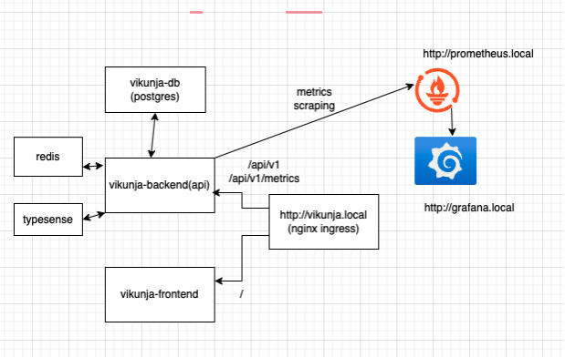

# distribution-task
Vikunja application deployment in Kubernetes 

I used a Kind cluster deployed in my laptop to setup this case study project. My design decisions and details are as below. 

Diagram: 

1. Setting Up a Kubernetes Cluster 
Choice: Kind (Kubernetes in Docker) 
Justification: Kind is a lightweight option for local development and testing of Kubernetes clusters. It allows us to create clusters quickly using Docker containers, making it ideal for development environments. For production, we might consider cloud-based solutions like GKE, EKS, or AKS. 
 

2. Deployment Templating Tool 
Choice: Helm  
Helm is a powerful package manager for Kubernetes that simplifies the deployment and management of applications. It allows us to define, install, and upgrade even the most complex Kubernetes applications using Helm charts. Helm's templating capabilities enable us to manage configurations efficiently and maintain consistency across environments.  
Vikunja provides an official helm chart to deploy all the associated components and application, but I decided to go with custom helm charts ince it gave me more control and freedom for customization  
For redis, typesense, postgresql, Prometheus and Grafana I used Bitnami helm charts and customised it according Vikunja app requirements. To deploy vikunja api and frontend apps, I created two separate custom helm charts and yaml templates. All the services are deployed with proper resource settings, health probes, and HA (Horizontal pod autoscaler). 

 

3. Database Deployment Strategy 
Choice: Self-hosted PostgreSQL 
I used Self-hosting PostgreSQL using bitnami postgres helm chart because it allows for greater control over the database configuration and optimizations. Since I did the setup in local cluster, it was the only option for me. However, if the application scales significantly or requires high availability, we need to change to a managed service like AWS RDS or Google Cloud SQL for easier management and built-in redundancy. 

4. High Availability and Resilience 
I used HPA and scaling conditions for High Availability.  Configured readiness and liveness probes to manage service health. 

5. Traffic distribution 
I used a Kubernetes Service of type clusterIP together with nginx ingress to distribute traffic across the applications and pod replicas. 

6. Network Optimization 
I used service type ClusterIP and configured Ingress resources to manage traffic efficiently. 

7. Monitoring and Debugging 
Used tools such as Prometheus and Grafana for monitoring the application. Configured health checks and resource limits to ensure optimal performance. Prometheus configured with few alert rules and implemented a dashboard for Vikunja application to monitor. 
 
8. Deployment script
I added a simple bash script: deploy.sh to automate the deployment in local machine.

I did not added Keycloak to the stack for IAM because of resource limitations in my local machine. But, the setup is quite straightforward with Keycloak helm chart. Once its installed we can create a custom realm and client with OpenID settings for Vikunja app. In app we need to update the configmap to update OpenID settings as per documentation: https://vikunja.io/docs/openid-example-configurations/#keycloak

 

 

 

 